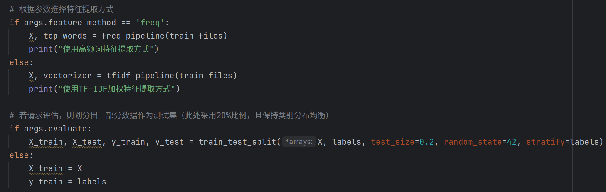
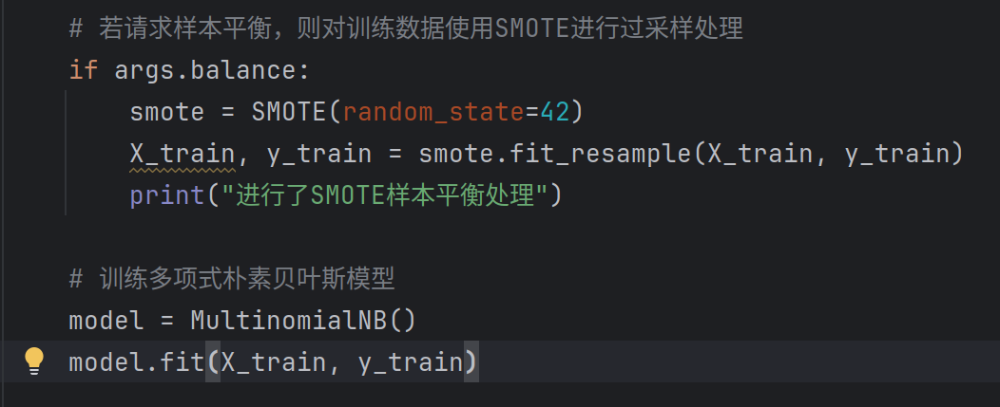
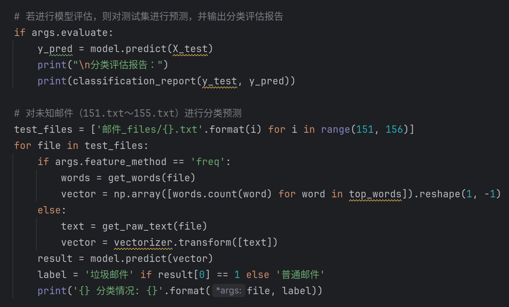
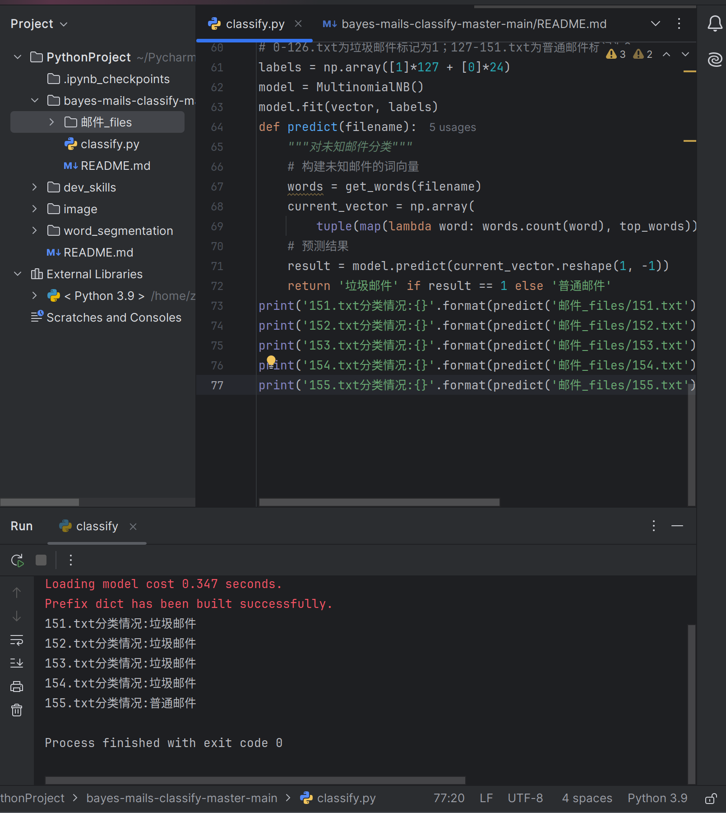

# 朴素贝叶斯邮件分类

## 1. 项目简介

本项目实现了基于多项式朴素贝叶斯的邮件分类，主要采用两种特征提取方法：
- **高频词特征**：通过统计训练邮件中出现次数最多的100个词作为特征构建向量。
- **TF-IDF加权特征**：利用 `TfidfVectorizer` 对邮件文本进行向量化，体现词语的重要性。

## 2. 算法基础

采用多项式朴素贝叶斯分类器，其核心思想基于贝叶斯定理：
- 假设各特征（单词）之间条件独立；
- 根据每封邮件中各单词出现频率（或TF-IDF值），计算垃圾邮件和普通邮件的后验概率，选择概率较高的类别作为预测结果。

## 3. 数据处理流程

- **分词处理**：利用 jieba 对邮件文本进行分词，过滤掉无意义字符和长度为1的词。
- **停用词过滤**：在TF-IDF模式下，设置 `stop_words='english'`（也可根据需要扩展停用词表）。
- **特征构建**：
  - 高频词模式下，统计每封邮件中前100个高频词的出现次数；
  - TF-IDF模式下，通过TF-IDF计算每个词的重要性，并构成向量。

## 4. 特征模式切换

运行程序时，通过命令行参数 `--feature_method` 进行切换：
- 使用高频词特征：
  ```bash
  python classify.py --feature_method freq
  ```


## 5.样本平衡处理


## 6.增加模型评估指标


## 7.classify运行结果
